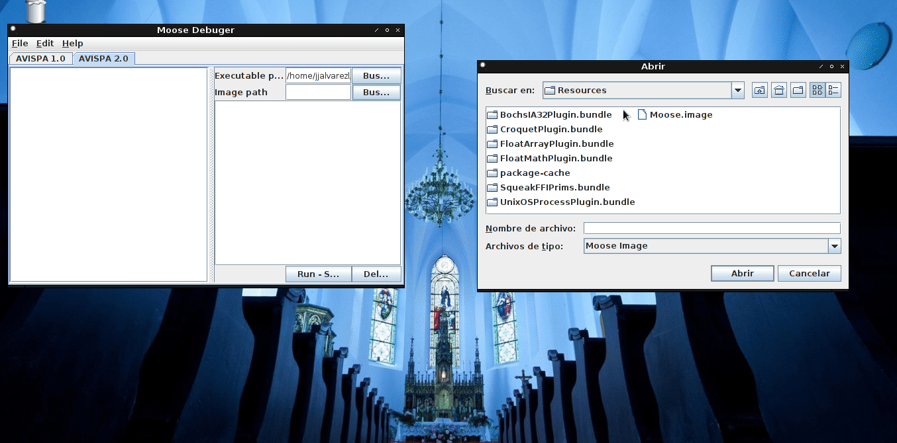

# MooseDebug

 

MooseDebug is a open-source application for [Moose](http://moosetechnology.org/) execution

It works with java 8.

Support
=======

* Email: jhon.jairo.alvarez.londono@gmail.com

Please email me if you see something wrong or abnormal.

You can always be a contributor or you can [add an issue here](https://github.com/jjalvarezl/MooseDebug/issues)